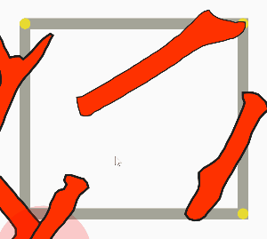
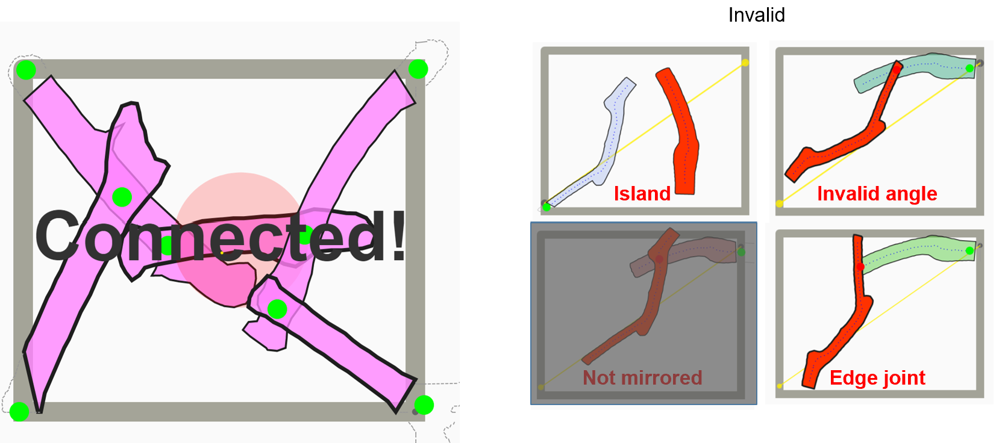

User Interface Coursework
============================
Welcome to the asignment page of user interface course at the University of Tokyo. The entire course schedule is shared in the following link:
https://www-ui.is.s.u-tokyo.ac.jp/~takeo/course/2020/ui/index.html

# The Game
### Check the game with key inputs
https://hironoriyh.github.io/

<p float="left">
  
  
</p>

<!--   -->

The game interface is composed of boundary, target points, and branches.
Branches can be connected within a certain angle range and importantly one branch must be mirrored. The mirror rule came from the fabrication constraint of 3-axis CNC router. 

### Reference (p5.js)
editor: https://editor.p5js.org/ 

code references: https://p5js.org/reference/

## Game Instruction
### Goal: Connect 4 corners by moving branches 
### How to use:  
- Select a branch by Enter key
- Move the branch by Up, Down, Left, Right keys 
- Rotate the branch by Left or Right keys with Control key 
### Colors: 
- Green dots: valid joints. Red dots: invalid joints
- Invalid group: Red branches. Valid group: other colors.

# Assignment 1. Implement your own UI
As the lecture introduced assignment, we'd like you to implement basic UIs such as moving and rotating to manipulate 2D tree branches. The programming language we use here is  Javascript using p5js (Javascript version of Processing); however, it is up to you which language you use. 

The current UI is set with keyboard inputs using the function in the following link.
https://p5js.org/reference/#/p5/keyPressed 

Focusing on basic manipulations (move, rotate, and mirror), you can develop your own interaction. You can set your own goal of UI development, such as intuitive, smooth, or fun. As an intuitive UI example, [you can take mouse inputs.](https://github.com/hironoriyh/ui_lecture_assignment/blob/9f2d841e5770d647dd21f749755b51c29332cd30/js/Events.js#L38) By clicking, a user can select a branch and move/rotate by dragging. Mouse input is just an example. Please feel free to implement your own UI ideas that are highly appreciated!

Once you finish your implementation, please make screen captha of you using your UI by Bandicam, Camstudio, and Screen2Gif etc. I personally recommend to make GIF file as you can place it easily.The video would be 30sec to max 1min. Also, please summarize your UI in the report as well by describing your UI design concept and how to use it. This part of the report can be written in README.md as well for the ease of sharing.

## Minimum requirement
select branches by mouse click by using the checkCloseBranch function https://github.com/hironoriyh/ui_lecture_assignment/blob/7632384aa50d987c4c7e8d198daf54ee4a6f4ce2/js/Events.js#L60

## Bonus points
    複数ユーザーのゲームの結果をうまく統合する
    サジェストシステムの実装や提案
    スコアリング方法の提案
    レイアウトの審美性を評価する方法の提案
    枝以外の不定形材をインポート
    不定形な枝のContourの効率的な表現（その際どのようにつなげるかも記述する）
    枝を効率的にスキャンする方法の提案


# Assignment 2. User study: Test your UI with participants
While you implement your code, you will become an expert of your UI. To validate the usability of your UI, please conduct a user study with your friends and families. You can first let them use your UI without any instructions to see how intuitive your UI is, and then provide more information such as how to use your UI and the aim of the UI. 

A general user study would be as follows:
1. Arrange schedule with your pariticipants and don't forget to tell estimated duration for the study (15min?)
2. Don't forget to prepare some snacks for your participants!
3. Introduce the overall idea of the game and the goal (you can explain initial state and goal state of the game). You can also ask basic background of the user (e.g., age, proficiency with computer UI in general, how long you use computer etc...)
4. Let the participant play the game WITHOUT telling the detail instrucation of your UI. You can also measure/track quantitative metrics such as duration to complete, number of clicks, gaze of the user (advanced) etc...  
5. Ask questions you prepared (Which part did you get stuck? Was feedback sufficient? Did you understand the overall rule? etc...). 
6. Get more general comments from the pariticipant such as how did you find the user study? How can I improve it? etc...


<!-- Please measure the duration for completing the game to see how smooth your UI is. Please summarize findings during user study including interviews. The questions of the interview could be - how intuitive was it and where did you get stuck? - Any comment for improving the UI? -->


# Dues for the assignments and how to submit it
## Dues
  7/13: Show and tell of your UI
  7/20: Due for the submission of reports

## How to submit?
As for the report, please put two reports (1. Implementation and 2. User study) together in a PDF format and name it as ```<your student ID>_<your name>.pdf```
and for your UI impelemntation and video, compress files in ```<your student ID>_<your name>.zip```


# Questions
Please use github issue so that other students can share your questions. 

# Folder structure and relevant files to this assignment
The overview of the folder strucutre is as following. 
```
index.html
├── data
│    ├── br12
│         ├──plate.json
│         ...
├── js
│    ├── main.js <-- main loop of p5.js
│    ├── Events.js <-- you can modify this file to for your own interaction
│    ...
│
├── lib   
└── style
```
Within these files, you can focus on ```js/main.js and js/Events.js``` to implement your interaction. On top of that, please take a look on ```data/plate.json``` and how it is read in ```js/LibraryBranch.js```. 

